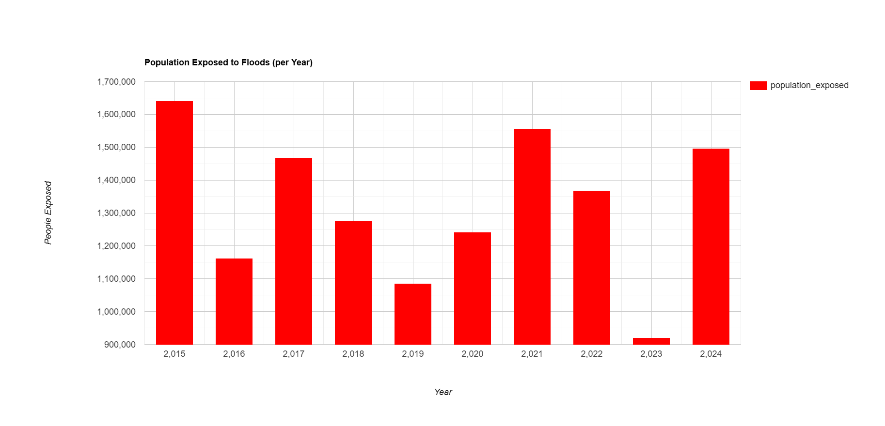

# 🌊 Flood Mapping in Afar Region, Ethiopia (2015–2024)

This project applies Google Earth Engine (GEE) to map and assess flooding in the Afar region using Sentinel-1 SAR data, ESA WorldCover land use data, and GHSL population data.

## 📌 Objectives

- Map flood extent for each year from 2015 to 2024
- Quantify flooded area per year
- Identify land use/land cover types most affected
- Estimate exposed population per year
- Generate flood hazard maps for visualization and policy use

## 🛰️ Data Sources

| Dataset                   | Source                                                  |
|---------------------------|---------------------------------------------------------|
| Sentinel-1 SAR (VV)       | `COPERNICUS/S1_GRD`                                     |
| Land Cover (2020)         | `ESA/WorldCover/v100`                                   |
| Population (2015)         | `JRC/GHSL/P2016/POP_GPW_GLOBE_V1`                       |
| Admin Boundaries          | `FAO/GAUL/2015`                                         |
| Region:                   | Afar, Ethiopia                                          |

## 🗂️ Project Files

| File/Folder                | Description                            |
|---------------------------|----------------------------------------|
| `flood_mapping_script.js` | GEE JavaScript code                    |
| `results/`                | Output images/maps (PNG)               |
| `data/`                   | Exported CSVs with statistics          |
| `LICENSE`                 | MIT License for reuse and distribution |
| `.gitignore`              | Optional ignored files (e.g., `.DS_Store`) |

## 📊 Results

- **Flood Area by Year**: `results/flood_area_by_year.png`, `data/flood_area_by_year.csv`
- **LULC Affected by Year**: `results/lulc_affected_by_year.png`, `data/lulc_affected_by_year.csv`
- **Population Exposed by Year**: `results/population_exposed.png`, `data/population_exposed.csv`
- **Flood Hazard Map**: `results/flood_hazard_map.png`

## 📈 Sample Visuals

```markdown




🧠 How to Run
Open Google Earth Engine Code Editor

Paste contents of flood_mapping_script.js

Change region, year, or thresholds if needed

Export maps or charts as needed

🔓 License
This project is licensed under the MIT License — see the LICENSE file for details.

## 👥 Authors

### 1️⃣ Mohammed Abdulahi  
PhD Candidate, Haramaya University  
📧 mohammed.mussa@haramaya.edu.et  

### 2️⃣ Zinabu Bora (Ph.D.)  
Postdoctoral Researcher – Environmental Ecological Construction  
National Engineering Technology Research Center for Desert-Oasis Ecological Construction  
Xinjiang Institute of Ecology and Geography, Chinese Academy of Sciences  
818 South Beijing Road, Urumqi, 830011, Xinjiang, China  
📧 zinabubora@ms.xjb.ac.cn | zinabu_bora@yahoo.com
Project Year: 2025